## Настройки Bus Coupler для работы с последовательным интерфейсом RS-232
## Содержание
1. Установка IP-адреса Bus Coupler 
2. Подключение к Bus Coupler через StartUp+ и подключение модуля последовательных интерфейсов
3. Подключение внешнего устройства по интерфейсу RS-232
4. Настройка параметров подключения RS-232
5. Чтение данных из внешнего устройства через RS-232
6. Получение данных из модуля последовательных интерфейсов через ModBus

### Установка IP-адреса Bus Coupler 
___
Рассмотрим установку IP-адреса Bus Coupler на примере устройства __AXL F BK ETH NET2__.
Установить IP-адрес устройства возможно следующим образом:
* Требуемый адрес устанавливается поворотными переключателями на корпусе устройства.
* Требуемый адрес устанавливается через специализированное ПО.

На корпусе устройства имеются поворотные переключатели S1 и S2, задающие режим работы.

 Рисунок 1 - Внешний вид Bus Coupler 

Код, соответствующий режиму работы, является суммой S1*10+S2. 

S1    | S2   | Код     | Функция
:---: |:----:|:-------:| :---:
0     | 0    | 00      | Удаленный доступ
0...5 | 1...0| 01...50 |Ручная установка адреса
5...15| 0...9| 51...159| Установка DHCP имени
0     | A    | 0A      | Статический адрес
0     | E    | 0E      | Сброс параметров IP
1     | A    | 1A      | Включить режим PnP
1     | B    | 1B      | Выключить режим PnP
12    | C    | 12C     | Сброс до заводских настроек

Перед установкой новых параметров следует сбросить параметры IP-адреса, выставив переключатели в положения S1 - 0; S2 - E, и перезагрузить устройство. Затем устанавливается необходимый режим, и снова перезагружается устройство. 

Для ручной установки IP-адреса следует:
* Сбросить параметры IP (код на переключателях 0Е). Перезагрузить устройство.
* Установить режим статического IP-адреса (код на переключателях 0А). Перезагрузить устройство.
* Установить требуемый адрес поворотными переключателями. Перезагрузить устройство.

После перезагрузки, устройство использует установленный IP-адрес.
Для автоматической установки IP-адреса следует:
* Сбросить параметры IP (код на переключателях 0Е). Перезагрузить устройство.
* Установить режим удаленного доступа (код на переключателях 00). 
В режиме удаленного доступа, Bus Coupler посылает продолжительные BootP запросы пока не получит действительный IP-адрес. 
* На ПК запустить программу [IPAssign](https://www.phoenixcontact.com/en-us/products/wireless-module-fl-wlan-1101-2702538) (Раздел Downloads - Software). Нажать далее.

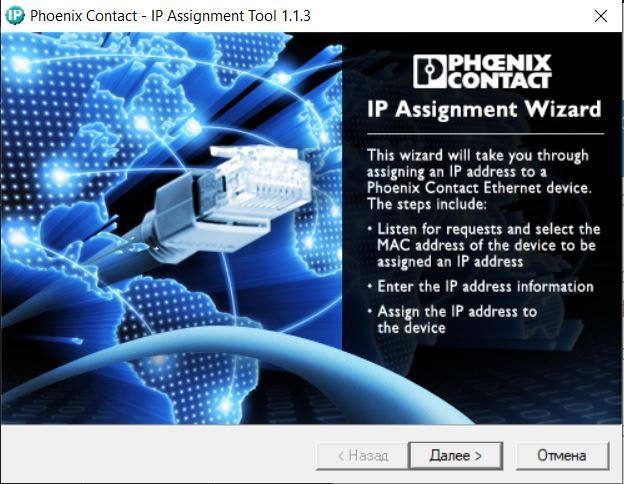

 Рисунок 2 - Интерфейс программы IPAssign 

* Дождаться появления устройства, выбрать его и нажать далее.

 Рисунок 3 - Новое устройство обнаружено 

* Установить требуемый IP-адрес и нажать далее.

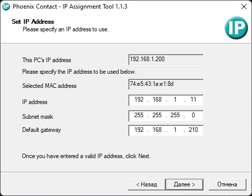

 Рисунок 4 - Установка IP-адреса 

* Дождаться успешной установки адреса и нажать готово. Перезагрузить устройство.

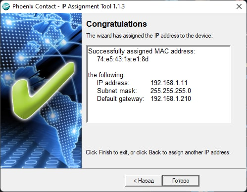

 Рисунок 5 - Успешная установка IP-адреса 

После установки IP-адреса, Bus Coupler работает по адресам xxx.xxx.0.xxx для разъема Ethernet X1 и xxx.xxx.1.xxx для X2.
### Подключение к Bus Coupler через StartUp+ и подключение модуля последовательных интерфейсов
___
Конфигурирование Bus Coupler происходит через программу [StartUp+](https://www.phoenixcontact.com/en-us/products/device-parameterization-startup-2700636) (Раздел Downloads - Software). 
После подключения Bus Coupler к ПК по Ethernet следует убедиться, что ПК находится в нужной подсети. Для этого следует открыть настройки сетей в панели управления пк и в настройках параметров адаптера выбрать неопознанную сеть.

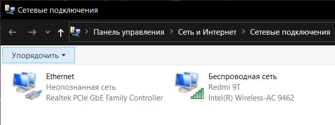

 Рисунок 6 - Cетевые подключения 

Далее в свойствах сети выбрать пункт *IP версия 4*. Установить параметры, соответствующие Bus Coupler. Обратите внимание на номер подсети: для разъема X1 - xxx.xxx.0.xxx и xxx.xxx.1.xxx для Х2.

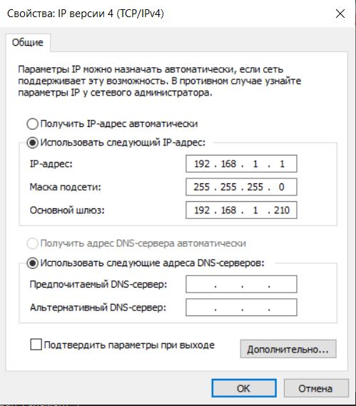

 Рисунок 7 - Параметры сетевого подключения для Bus Coupler 

- Запускаем программу StartUp+. Нас встречает окно создания нового проекта.

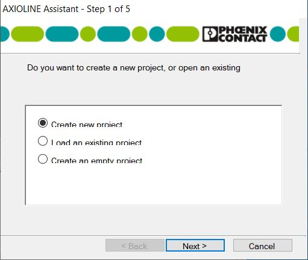

 Рисунок 8 - Стартовое окно StartUp+ 

- Выбираем пункт *Cоздать новый проект*.
- Далее вы списке выбираем *AXL F BK ETH NET2*.
- В списке выбора способа подключения выбираем *Ethernet TSP/IP*.
- Далее выбираем ручной ввод IP-адреса и указываем IP устройства.

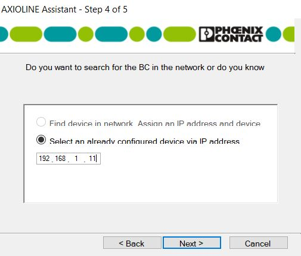

 Рисунок 9 - Окно установки адреса Bus Coupler 

- После всех действий появится окно Topology Scan Wizard для выбора подключенных к Bus Coupler. 

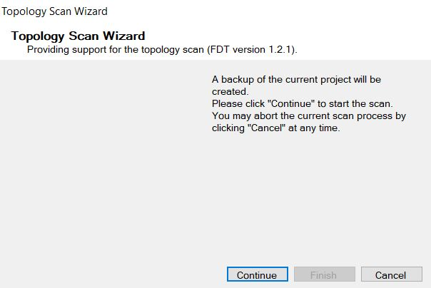

 Рисунок 10 - Окно Topology Scan Wizard 

- Нажимаем *Продолжить*
- После завершения сканирования в списке появится доступные устройства. Выбираем модуль последовательных интерфейсов *RS UNI XC 1H* и нажимаем продолжить.

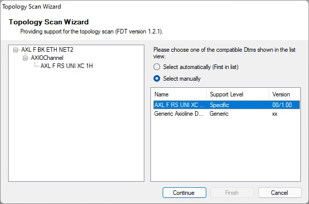

 Рисунок 11 - Результат сканирования доступных модулей 

- После всех действий откроется окно окончания настроек подключения. Нажимаем кнопку *Finish*

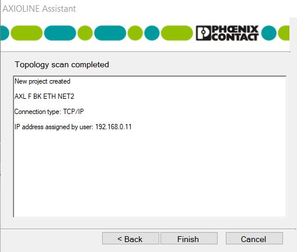

 Рисунок 12 - Окно окончания настроек подключения 

При успешном подключении в дереве проекта отобразится Bus Coupler и подключенный модуль.

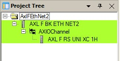

 Рисунок 13 - Дерево проекта в StartUp+ 

### Подключение внешнего устройства по интерфейсу RS-232
___
В качестве внешнего устройства выступают электронные весы ProMAS PM1H-100 4050. Они используют двухпроводное подключение.

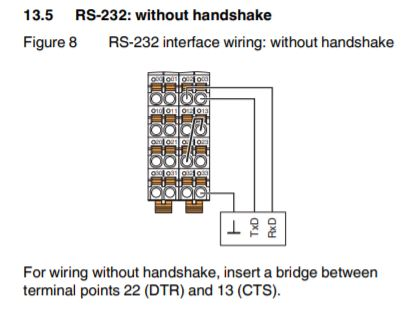

 Рисунок 14 - Схема двухпроводного подключения к модулю последовательных интерфейсов 

Перемычка включается между контактами DTR(22) и CTS(13).

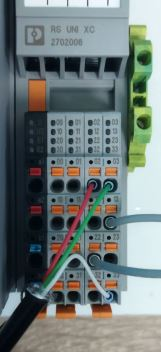

 Рисунок 15 - Подключение весов к модулю последовательных интерфейсов 

### Настройка параметров подключения RS-232
___
Возвращаемся в программу StartUp+. Выбираем модуль последовательных интерфейсов в дереве проекта и нажимаем на кнопку *Offline parameters* в верхней панели. Открывается окно настроек параметров последовательных интерфейсов. 

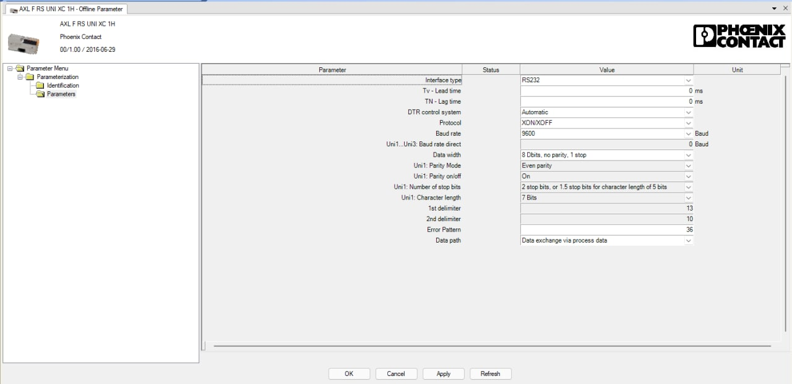

 Рисунок 16 - Окно настроек параметров последовательных интерфейсов 

Выбираем интерфейс RS-232 и протокол XON/XOFF. Было установлено, что весы отправляют вес ввиду набора символов вида *+xxx.xxkg*, где ххх.хх - вес в килограммах. В итоге параметры для связи с весами имеют вид, показанный на рисунке.

После каждого изменения параметров следует произвести процедуру инициализации, иначе считать данные из модуля может быть невозможно. Об этом свидетельствует мигающий зеленым индикатор D на корпусе модуля и Bus Coupler.
Для инициализации модуля переходим на веб-страницу Bus Coupler указав в поисковой строке браузера IP-адрес каплера. Если браузер сообщит об небезопасном соединении, проигнорируйте это. 
В результате откроется веб-страница каплера. 
Переходим в пункт *Configuration - Startup Behaviour*. 

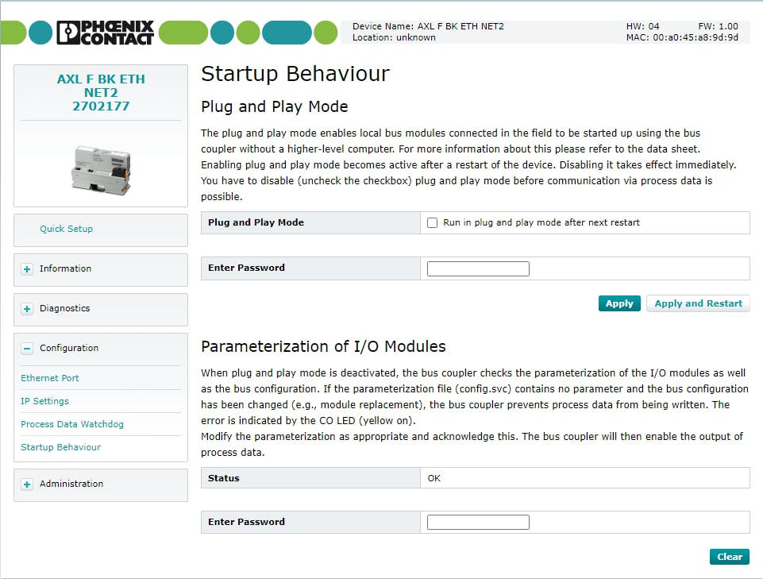

 Рисунок 17 - Веб-страница Startup Behaviour 

Устанавливаем галочку  *Run in plug and play mode after next restart*, указываем пароль (по умолчанию: private) и нажимаем *Apply and Restart*. После перезагрузки повторить те же действия убрав галочку *Run in plug and play mode after next restart*
### Чтение данных из внешнего устройства через RS-232
___
Кликом правой кнопкой мыши по модулю последовательных интерфейсов открывается список дополнительных параметров модуля. Выбираем **Functions-IO Check**. Открывается окно ввода/вывода модуля, где можно принимать или отправлять данных по интерфейсу.

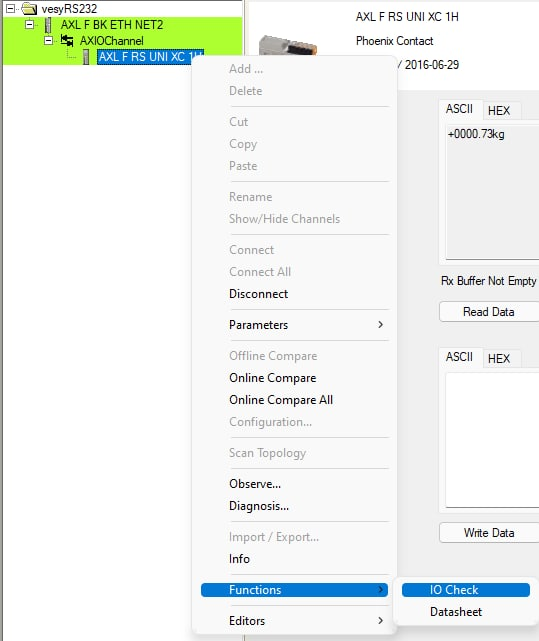

 Рисунок 18 - Выбор окна ввода/вывода модуля последовательных интерфейсов 

Буфер приёма-передачи модуля последовательных интерфейсов имеет ёмкость 4 кбайт. Принятые данные сохраняются в буфере в виде очереди и могут быть прочитаны. Для этого в окне ввода/вывода нажимаем кнопку *read*, на верхней панели отобразятся считанные данные. 

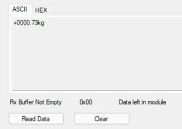

 Рисунок 19 - Результат считывания данных из буфера 

Если буфер заполнится, модуль начнет сигнализировать об ошибке индикатором E2.
### Получение данных из модуля последовательных интерфейсов через ModBus
___
Для получения данных из модуля прежде всего следует в окне настроек параметров последовательных интерфейсов установить *Data Pach* в режим *Data exchange via process data*.

В качестве программы для связи с модулем по ModBus выступает ModBus Doctor. Все подключенные к Bus Coupler модули получают свой диапазон адресов для записи и считывания. Посмотреть адреса можно в веб-странице каплера в разделе *Information - ModBus I/O Table*.

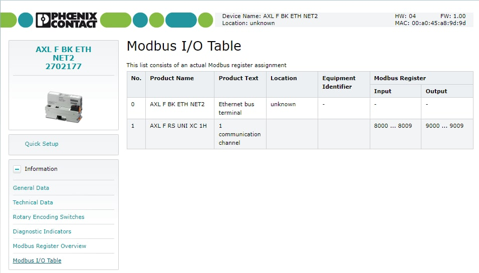

 Рисунок 20 - Перечень доступных адресов регистров в Bus Coupler 

В нашем случае регистры с адресами 8000-8009 служат для считывания данных, а 9000-9009 для записи команд в модуль последовательных интерфейсов.

Откроем две программы ModBus Doctor для более удобной записи и считывания. Во вкладке *Settings* следует установить адрес каплера, установить параметры подключения по ModBus и нажать кнопку *Conection*. 

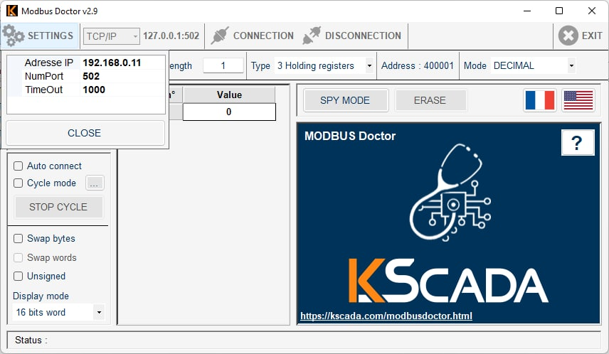

 Рисунок 21 - Подключение к каплеру через ModBus в программе ModBus Doctor 

По умолчанию при попытке считать данные из модуля, он вернет уровень заполнения буфера и количество принятых сообщений по последовательному интерфейсу. Для того, чтобы получить сами данные (в нашем случае вес), в регистр по адресу 9000 следует записать число 12288, что соответствует 30h в нулевом байте. Список и формат команд описан в документации на модуль. После записи команды в регистр, при следующих считываниях будут получены данные в виде ASCII символов и некоторые служебные байты.

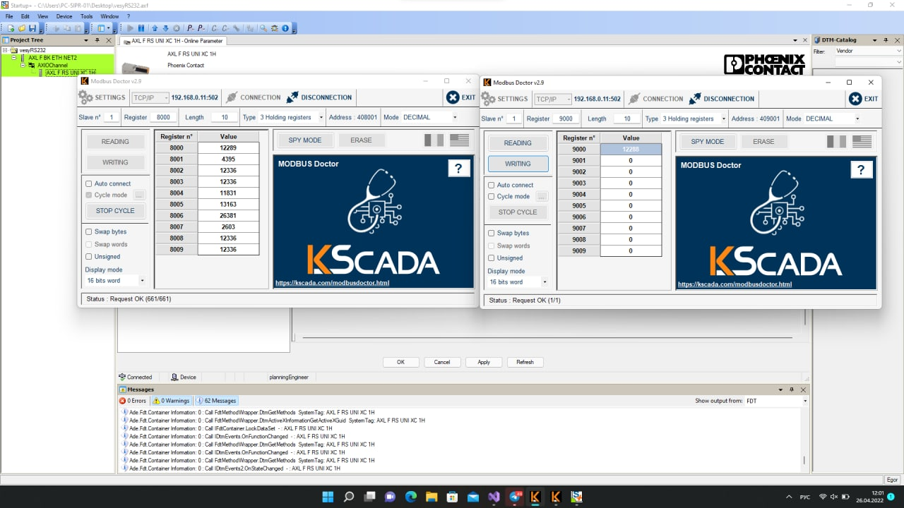

 Рисунок 22 - Результат считывания данных из модуля 

 В нашем случае в регистрах с 8001 по 8008 записаны символы *+000.73Kg*. Строит учитывать, что байты записаны по стандарту Intel, т.е. сначала идет младший байт, затем старший.
